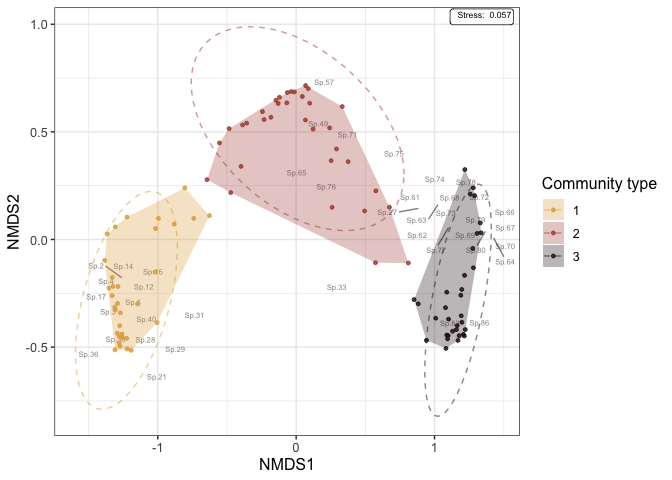
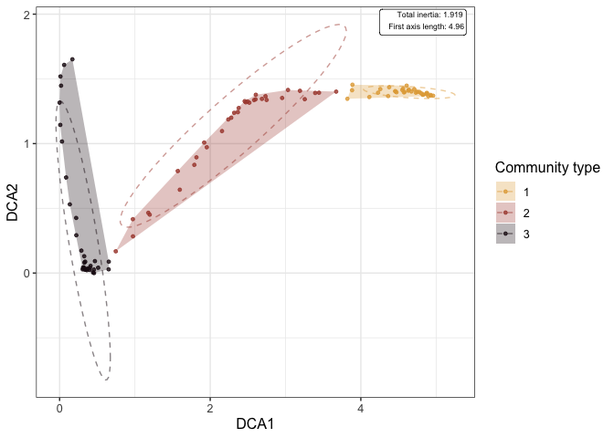
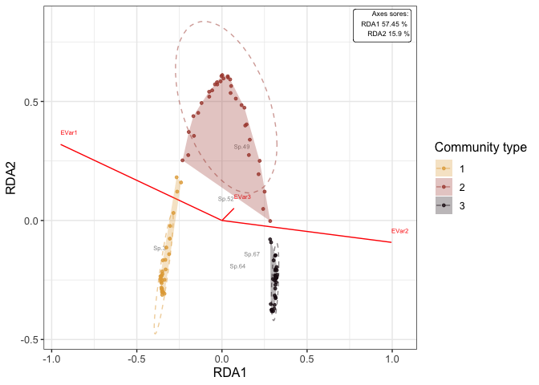
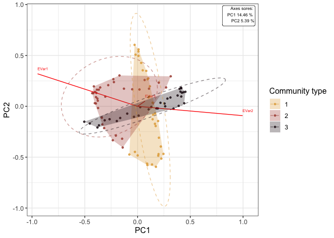
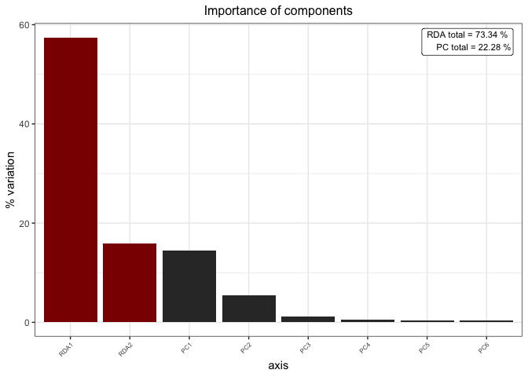

# Ordination-ggplots

Functions to quickly (gg)plot nMDS, DCA and RDA

## Description:

These are simple functions to easily plot the results of ordination
analyses (obtained with the *vegan* package) on R. A number of arguments
creates ggplot layers, and a ggplot object is returned. Additional user
defined layers can then be added to the output, for fully customized
plots.  
Other methods exist on R to achieve similar purposes (see the *ggvegan*
package, for instance). The present functions are nothing more than what
I have been using routinely over the years.

## Getting the functions:

You can either get the code directly from the repository, or use the
following:

``` r
library(devtools)
source("https://raw.github.com/Ecotoni/Ordination-ggplots/main/Visualise_nMDS.R")
source("https://raw.github.com/Ecotoni/Ordination-ggplots/main/Visualise_DCA.R")
source("https://raw.github.com/Ecotoni/Ordination-ggplots/main/Visualise_RDA.R")
```

## Basic examples:

*With the use of the small artificial data sets included in this
repository*

``` r
# Loading data:
Community <- readRDS("Community.rds")
Environment <- readRDS("Environment.rds")

## Basic analyses:
require(vegan)
# nMDS:
Community_nMDS <- vegan::metaMDS(Community[,-1], 
                                 distance = "bray", k = 2, plot = F,
                                 autotransform = TRUE,  wascores = TRUE,
                                 trymax = 100)

# DCA:
Comm_dat <- vegan::decostand(Community[,-1], method = "hellinger")
Community_DCA <- vegan::decorana(Community[,-1])

# RDA:
C <- as.matrix(vegan::decostand(Community[,-1], method = "hellinger"))
E <- as.matrix(vegan::decostand(Env, method = "standardize"))
Community_RDA <- vegan::rda(C ~ E)                                 
```

Grouping factor and colors:

``` r
# Factor:
Community_group <- c(rep("1", times = 33),
                     rep("2", times = 34),
                     rep("3", times = 33))

Community_color <- colorspace::sequential_hcl(4, palette = "Lajolla")[2:4]
```

Associated plots:

``` r
### nMDS plot:
GGnMDS_Community <- Visualise_nMDS(Community_nMDS, factor = Community_group, 
                                   factor.name = "Community type",
                                   display = c("sites", "species"),
                                   plot = FALSE,
                                   hull = TRUE, ellipses = TRUE,
                                   colors = Community_color)
GGnMDS_Community
```



``` r
### DCA plot:
GGDCA_Community <- Visualise_DCA(Community_DCA, factor = Community_group, 
                                 factor.name = "Community type",
                                  display = c("sites"),
                                  hull = TRUE, ellipses = TRUE,
                                  colors = Community_color)
GGDCA_Community
```



``` r
### RDA plot:
GGRDA_Community_RDA <- Visualise_RDA(Community_RDA, factor = Community_group, 
                                 factor.name = "Community type",
                                 axis = c("RDA1", "RDA2"),
                                 display = c("sites", "species", "arrows"),
                                 components.plot = TRUE,
                                 component.cut = 0.25,
                                 hull = TRUE, ellipses = TRUE,
                                 colors = Community_color)

GGRDA_Community_PC <- Visualise_RDA(Community_RDA, factor = Community_group, 
                                 factor.name = "Community type",
                                 axis = c("PC1", "PC2"),
                                 display = c("sites", "species", "arrows"),
                                 components.plot = FALSE,
                                 hull = TRUE, ellipses = TRUE,
                                 colors = Community_color)

GGRDA_Community_RDA$RDA
GGRDA_Community_PC
GGRDA_Community_RDA$Components
```




